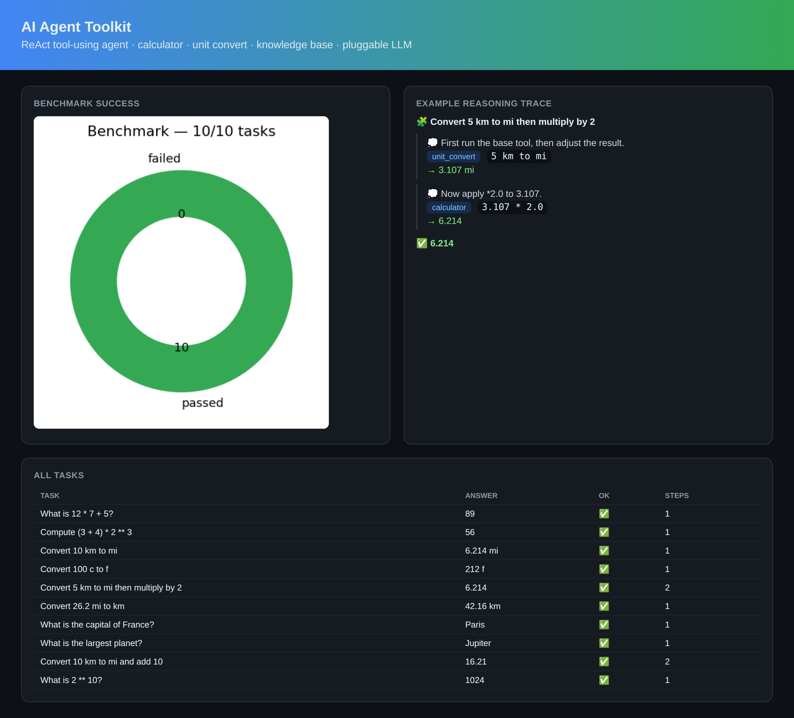

> **▶ [Live demo](https://riteshmamidi0905-lab.github.io/demos/ai-agent-toolkit.html)** — the interactive agent dashboard (task benchmark + step-by-step reasoning traces) this project generates.

# AI Agent Toolkit (`aiagent`)


A small but real **tool-using agent framework** built on the **ReAct** pattern
(Thought → Action → Observation → … → Answer). The agent loop is
**backend-agnostic**: it asks a *policy* for the next step, executes the tool,
feeds the observation back, and repeats. A deterministic **offline planner**
makes the whole thing testable in CI; **Gemini / OpenAI** backends plug into
the exact same interface for open-ended tasks.

```
task ─► policy.decide() ─► Action(tool, input) ─► tool() ─► Observation ─┐
          ▲                                                              │
          └──────────────────  (loop with growing history)  ◄───────────┘
                                    └─► Final(answer)
```



## What makes it real

- **True ReAct feedback** — multi-step tasks feed one tool's output into the
  next. `"Convert 5 km to mi then multiply by 2"` runs `unit_convert → 3.107 mi`,
  then `calculator(3.107 * 2) → 6.214`. The second step *depends on* the first
  step's observation.
- **Safe tools** — the calculator evaluates via a restricted **AST walk**, not
  `eval`, so `__import__('os').system(...)` raises instead of executing. Plus a
  unit converter, a retrieval knowledge base, and text stats. Add a tool by
  wrapping a function in `Tool`.
- **Deterministic offline planner** — parses the task, routes to tools, and
  composes results. **10/10 on the benchmark**, no API key required.
- **Pluggable LLM** — `GeminiBackend` / `OpenAIBackend` implement the same
  `.decide()` method by prompting in ReAct format and parsing the reply.

## Results

```
Benchmark: 10 / 10 tasks passed (100%)
Example : "Convert 5 km to mi then multiply by 2"
          → unit_convert(5 km to mi) → 3.107 mi
          → calculator(3.107 * 2)    → 6.214   ✅
```

## Quickstart

```bash
git clone https://github.com/riteshmamidi0905-lab/ai-agent-toolkit.git
cd ai-agent-toolkit
pip install -e ".[dev]"

python examples/run.py   # runs the benchmark, writes docs/dashboard.html
pytest -q                # 11 passing tests
```

```python
from aiagent import Agent, default_tools, RuleBasedPlanner

agent = Agent(default_tools(), RuleBasedPlanner())
res = agent.run("Convert 26.2 mi to km")
print(res.answer)                 # 42.16 km
for step in res.trace:            # inspect the reasoning
    print(step.tool, step.tool_input, "->", step.observation)
```

## Plugging in a real LLM

```python
# pip install google-generativeai ; export GEMINI_API_KEY=...
from aiagent import Agent, default_tools
from aiagent.cloud import GeminiBackend
agent = Agent(default_tools(), GeminiBackend())   # same loop, LLM policy
agent.run("What's the population of France divided by its area?")
```

## Project layout

```
aiagent/
  tools.py      # safe calculator (AST), unit convert, knowledge base, text stats
  agent.py      # backend-agnostic ReAct loop + trace/result types
  backend.py    # deterministic offline planner (RuleBasedPlanner)
  benchmark.py  # task suite + success-rate scoring
  cloud.py      # optional Gemini / OpenAI LLM backends
  viz.py        # benchmark chart + reasoning-trace HTML dashboard
examples/run.py
tests/          # 11 passing tests
```

## License

MIT © Ritesh Mamidi
